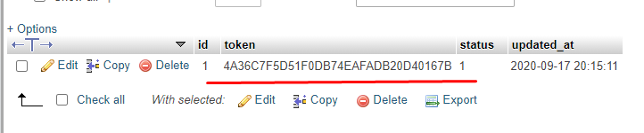
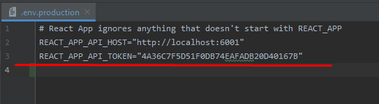

# API

### Installation
   * Import the file `dump.sql` into the MySQL DB
        * Create the Database, pleas check the collation Encoding `utf8_general_ci` OR `utf8mb4_general_ci`
        * If you have any issue with the Authorization between client and Server, please have a look the two files on client `.env.production` AND `.env.development`
        * Inside the client .env files have a look the variable `REACT_APP_API_TOKEN` for Token that should have this token in the table `token` on DB and also check the variable `REACT_APP_API_HOST` to point to the correct server api.
        
        
        
        
   
   
   * Configure the `.env` using the example file `.env.dist`
   * Execute the command `npm install` inside the directory `client`
   * Execute the command `npm install` inside the directory `server`
   
### Run Client DEV
   * Inside the directory `client`
   * Run the command `npm run start` or `npm start`
   
### Run Server DEV
   * Inside the directory `server`
   * Run the command `npm run dev` using nodemon
   
### Test Server
   * Inside the directory `server`
   * Run the command `npm run test`
   
   ** There is only one example test